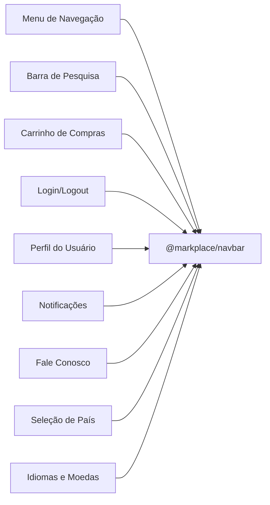

# Navbar Microfrontend

Esse microfront é responsável por gerenciar e manter o header do app, que inclui uma barra de pesquisa. Esse microfrontend pode incluir funcionalidades adicionais, como sugestões de autocompletar, acesso a categorias populares, entre outros.

Hospedado em https://meli-marketplace-navbar.vercel.app/marketplace-navbar.js



## 📦 Instalação e Configuração

### Pré-requisitos

-   Node.js (versão 18.18.0+)
-   yarn

### Como rodar esse microfrontend de forma independente?

1. Instale as dependências:

    ```bash
    yarn install
    ```

2. Execute o servidor de desenvolvimento:

    ```bash
    yarn dev:standalone
    ```

3. Acesse o projeto no navegador:

    ```
    http://localhost:9001
    ```

## 🧪 Testes

Para rodar os testes, execute:

```bash
yarn test
```
