# Product Microfrontend

Esse microfront é responsável exibir detalhes completos de cada item, incluindo descrições, imagens, avaliações e recomendações. Os usuários podem adicionar itens ao carrinho, escolher variações, e acessar informações sobre garantias e disponibilidade, tornando a compra simples e informativa.

Hospedado em https://meli-marketplace-product.vercel.app/marketplace-product.js

```mermaid
flowchart LR
    main["@markplace/product"]

    detalhes["Página de Detalhes do Produto"]-->main
    avaliacoes["Avaliações e Comentários"]-->main
    recomendacoes["Recomendações de Produtos"]-->main
    favoritos["Produtos favoritos"]-->main
    carrinho["Adicionar ao Carrinho"]-->main
    tamanho["Tamanho e Cores"]-->main
    disponibilidade["Informações de Disponibilidade"]-->main
    compartilhar["Compartilhar Produto"]-->main
    videos["Vídeos do Produto"]-->main
    politica["Política de Devolução"]-->main
```



## 📦 Instalação e Configuração

### Pré-requisitos

-   Node.js (versão 18.18.0+)
-   yarn

### Como rodar esse microfrontend de forma independente?

1. Instale as dependências:

    ```bash
    yarn install
    ```

2. Execute o servidor de desenvolvimento:

    ```bash
    yarn dev:standalone
    ```

3. Acesse o projeto no navegador:

    ```
    http://localhost:9003
    ```

## 🧪 Testes

Para rodar os testes, execute:

```bash
yarn test
```
