# Search Microfrontend

Esse microfront é responsável por lidar com exibições de pesquisas de produtos, seja das mais simples ou das mais avançadas.

Hospedado em https://meli-marketplace-search.vercel.app/marketplace-search.js

```mermaid
flowchart LR
    main["@markplace/product"]

    resultados["Resultados de Pesquisa"]
    sugestoes["Sugestões de Pesquisa"]
    filtros["Filtros Avançados"]
    ordenacao["Ordenação"]
    pagina["Página de Categorias"]
    resultados["Resultados em Grade ou Lista"]
    comparacao["Comparação de Produtos"]
```



## 📦 Instalação e Configuração

### Pré-requisitos

-   Node.js (versão 18.18.0+)
-   yarn

### Como rodar esse microfrontend de forma independente?

1. Instale as dependências:

    ```bash
    yarn install
    ```

2. Execute o servidor de desenvolvimento:

    ```bash
    yarn dev:standalone
    ```

3. Acesse o projeto no navegador:

    ```
    http://localhost:9002
    ```

## 🧪 Testes

Para rodar os testes, execute:

```bash
yarn test
```
